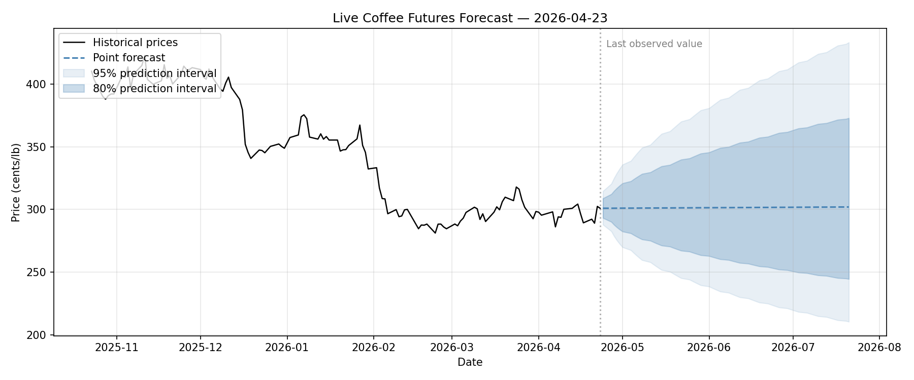

# Coffee Futures Forecasting Model

A **GJR-GARCH(1,1)-t** model that produces a 63-business-day price forecast for
ICE Coffee C futures with 80% and 95% prediction intervals.
Updates daily at 21:00 UTC (weekdays).



Latest forecast: [`forecasts/latest_forecast.csv`](forecasts/latest_forecast.csv)

Past runs: [`forecasts/archive/`](forecasts/archive/)

---

This repository is both:

- a **live deployment** of the GJR-GARCH forecasting model above, and
- a **reproducible research benchmark** backing the paper
  *"Forecasting Coffee Futures: A Benchmark of Simple and Foundation Models on
  a Near-Random Series."* The benchmark compares ten models across five
  categories over 32 years of daily prices (1994&ndash;2026) and motivates
  the choice of a volatility model for deployment.

## Repo layout

```
coffee-futures-forecasting-model/
|-- coffee_forecast/         # Importable Python package
|   |-- config.py            # Constants, paths, color map
|   |-- data.py              # load_coffee_data
|   |-- metrics.py           # calculate_metrics (MAE, RMSE, MAPE, sMAPE, MASE)
|   |-- models.py            # 5 wrapper classes with a shared predict() API
|   |-- backtest.py          # get_forecast_origins, run_test, run_multi_scale_backtest
|   |-- forecastability.py   # Spectral Omega, Permutation Entropy, Hurst + Lo's R/S
|   |-- stats_tests.py       # Diebold-Mariano, Model Confidence Set
|   |-- deployment.py        # GJR-GARCH forecast, Yahoo fetch, plotting
|   `-- viz.py               # Reusable plotting helpers
|-- notebooks/               # Ordered walk-through of the analysis
|   |-- 01_backtest_run.ipynb
|   |-- 02_backtest_plots.ipynb
|   |-- 03_backtest_stats.ipynb
|   |-- 04_forecastability.ipynb
|   `-- 05_deployment_garch.ipynb
|-- scripts/
|   |-- run_backtest.py        # CLI equivalent of notebook 01
|   |-- run_forecast.py        # Daily deployment runner (cron / GitHub Actions)
|   `-- export_csv.py          # One-time .xls -> .csv conversion (rerun after .xls re-download)
|-- data/
|   |-- Coffee_Historical_Prices.xls  # Raw ICE source (Coffee C, downloaded Feb 2026)
|   `-- coffee.csv                    # Cleaned: 8,104 daily closes (ds, y)
|-- results/                 # Research-benchmark outputs (CSVs + figures)
|   |-- csv/
|   `-- figures/
`-- forecasts/               # Live-deployment outputs (updated daily)
    |-- latest_forecast.png  # most recent forecast plot (overwritten daily)
    |-- latest_forecast.csv  # most recent forecast (overwritten daily)
    `-- archive/             # per-run CSV snapshots (datestamped, retained)
```

## Setup

**Prerequisites:** Python 3.11 (tested on 3.11.15). `pyproject.toml` pins
`>=3.11,<3.12`; the exact resolved environment is captured in
`requirements.lock.txt`.

```bash
git clone <repo-url>
cd coffee-futures-forecasting-model

python -m venv .venv
source .venv/bin/activate        # Windows: .venv\Scripts\activate

pip install -e .                 # installs the coffee_forecast package
```

The editable install lets notebooks write `from coffee_forecast import ...`
without any `sys.path` hacks.

## Running the benchmark

From a notebook:

```python
from coffee_forecast import load_coffee_data, run_multi_scale_backtest

df = load_coffee_data()
summary, step_errors = run_multi_scale_backtest(df, models, scales=[1, 10, 30, 60])
```

or from the command line:

```bash
python scripts/run_backtest.py
```

Both produce `results/csv/summary_all_scales.csv` and
`results/csv/step_errors_all_scales.csv`, which feed every downstream
notebook.

## Running the live forecast

The deployment pipeline is a single script:

```bash
python scripts/run_forecast.py
```

It loads the committed history, appends any newer Coffee C futures closes
from Yahoo Finance (`KC=F`), fits GJR-GARCH(1,1)-t on log-returns, and
writes a 63-day forecast to `forecasts/latest_forecast.csv` and
`forecasts/latest_forecast.png`. The same script is what regenerates the
image at the top of this README on its daily schedule.

## Notebook order

1. `01_backtest_run.ipynb` &mdash; Load data, assemble the 10-model suite,
   run a single-window first test, then the rolling-window backtest at
   4 scales (1, 10, 30, 60 origins), export CSVs.
2. `02_backtest_plots.ipynb` &mdash; MAE convergence across scales,
   60-origin distribution, and a per-origin deep dive (Granite TTM vs. RWD).
3. `03_backtest_stats.ipynb` &mdash; Diebold-Mariano and Model Confidence
   Set applied to the 60-origin benchmark output, establishing that nine
   of ten models are jointly indistinguishable at $\alpha = 0.10$.
4. `04_forecastability.ipynb` &mdash; A priori forecastability diagnostics:
   unit-root tests (ADF, KPSS, Phillips-Perron), Spectral Predictability,
   Permutation Entropy, Hurst + Lo's modified R/S, Lo-MacKinlay variance
   ratio, and the largest Lyapunov exponent. Explains *why* simple
   baselines aren't beaten on this series.
5. `05_deployment_garch.ipynb` &mdash; Validates GJR-GARCH(1,1)-t as the
   live-deployment model (drift test, distribution fit, ARCH test, model
   comparison, expanding-window coverage check) and produces the live
   forecast CSV + PNG in `forecasts/`.

## Citation

If you use this code, please cite the accompanying paper.
