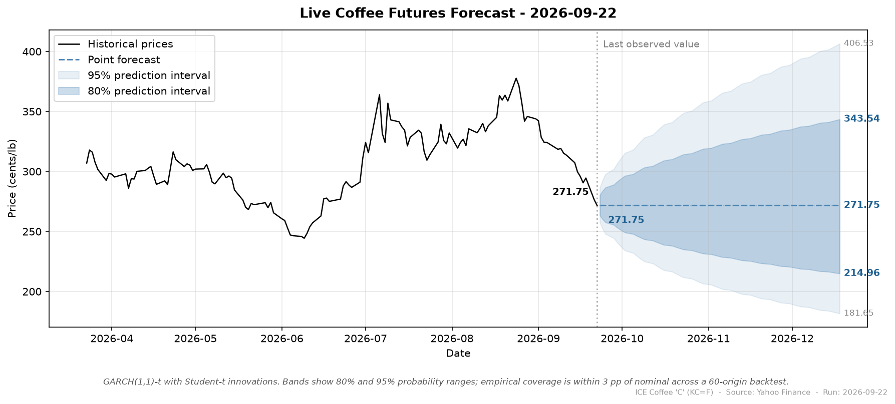

# Coffee Futures Forecasting Model

A **GARCH(1,1)-t** model that produces a 63-business-day price forecast for
ICE Coffee C futures with 80% and 95% prediction intervals.
Updates daily at 23:00 UTC (weekdays) &mdash; comfortably after ICE Coffee C
settlement and Yahoo Finance's data refresh.



Latest forecast: [`forecasts/latest_forecast.csv`](forecasts/latest_forecast.csv)

Past runs: [`forecasts/archive/`](forecasts/archive/)

---

This repository is both:

- a **live deployment** of the GARCH forecasting model above, and
- a **reproducible research benchmark** that compares ten forecasting
  models across five categories over 32 years of daily prices
  (1994&ndash;2026) and motivates the choice of a volatility model for
  deployment.

## Notebooks

The `notebooks/` folder is the main read-through &mdash; the analysis
unfolds across six notebooks. Each renders directly on GitHub, and
static PDF copies live in [`notebooks/pdf/`](notebooks/pdf/) for
offline reading.

1. [`01_backtest_run.ipynb`](notebooks/01_backtest_run.ipynb) &mdash;
   Load data, assemble the 10-model suite, run a single-window first
   test, then the rolling-window backtest at 4 scales (1, 10, 30, 60
   origins), export CSVs, and visualize the results: MAE stabilization
   across scales, the 60-origin distribution, and a per-origin deep
   dive (IBM Granite TTM vs. RWD).
2. [`02_backtest_stats.ipynb`](notebooks/02_backtest_stats.ipynb) &mdash;
   Diebold-Mariano and Model Confidence Set applied to the 60-origin
   benchmark output, establishing that nine of ten models are jointly
   indistinguishable at $\alpha = 0.10$.
3. [`03_stationarity_diagnostics.ipynb`](notebooks/03_stationarity_diagnostics.ipynb)
   &mdash; The standard finance-econometrics battery for weak-form
   market efficiency: ADF / KPSS / Phillips-Perron unit-root tests,
   Ljung-Box on returns, and the Lo-MacKinlay heteroskedasticity-robust
   variance-ratio test. Explains *why* simple baselines aren't beaten
   on this series.
3b. [`03b_exploratory_dynamics.ipynb`](notebooks/03b_exploratory_dynamics.ipynb)
   &mdash; Independent confirmations from the nonlinear-dynamics and
   signal-processing literatures: Hurst + Lo's modified R/S, spectral
   predictability $\Omega$, permutation entropy, and Rosenstein
   Lyapunov with a surrogate-data null. Not load-bearing for the
   weak-form-efficiency conclusion &mdash; the standard battery in
   notebook 03 already settles that &mdash; but corroborates it from
   different mathematical angles.
4. [`04_deployment_garch.ipynb`](notebooks/04_deployment_garch.ipynb)
   &mdash; Validates GARCH(1,1)-t as the live-deployment model
   (drift test, distribution fit, ARCH test, residual diagnostics,
   expanding-window coverage check at five nominal levels) and
   produces a reproducible sample forecast at
   `results/figures/garch_sample_forecast.png`.
5. [`05_rolling_vs_expanding_audit.ipynb`](notebooks/05_rolling_vs_expanding_audit.ipynb)
   &mdash; Methodology audit comparing rolling-window (fixed
   1,536-day) and expanding-window training for the GARCH(1,1)-t
   calibration backtest. The expanding-window pooled-coverage numbers
   in this notebook are the source of the 5-level coverage results
   reported in the paper's Table II.

## Repo layout

```
coffee-futures-forecasting-model/
|-- coffee_forecast/         # Importable Python package
|   |-- config.py            # Constants, paths, color map
|   |-- data.py              # load_coffee_data
|   |-- metrics.py           # calculate_metrics (MAE, RMSE, sMAPE)
|   |-- models.py            # 5 wrapper classes with a shared predict() API
|   |-- backtest.py          # get_forecast_origins, run_test, run_multi_scale_backtest
|   |-- forecastability.py   # Spectral Omega, Permutation Entropy, Hurst + Lo's R/S
|   |-- stats_tests.py       # Diebold-Mariano, Model Confidence Set
|   |-- deployment.py        # GARCH forecast, Yahoo fetch, plotting
|   `-- viz.py               # Reusable plotting helpers
|-- notebooks/               # Ordered walk-through of the analysis
|   |-- 01_backtest_run.ipynb
|   |-- 02_backtest_stats.ipynb
|   |-- 03_stationarity_diagnostics.ipynb
|   |-- 03b_exploratory_dynamics.ipynb
|   |-- 04_deployment_garch.ipynb
|   `-- 05_rolling_vs_expanding_audit.ipynb
|-- scripts/
|   |-- run_backtest.py        # CLI equivalent of notebook 01
|   |-- run_forecast.py        # Daily deployment runner (cron / GitHub Actions)
|   `-- export_csv.py          # One-time .xls -> .csv conversion (rerun after .xls re-download)
|-- data/
|   |-- Coffee_Historical_Prices.xls  # Raw ICE source (Coffee C, downloaded Feb 2026)
|   `-- coffee.csv                    # Cleaned: 8,104 daily closes (ds, y)
|-- results/                 # Research-benchmark outputs (CSVs + figures)
|   |-- csv/
|   `-- figures/
`-- forecasts/               # Live-deployment outputs (updated daily)
    |-- latest_forecast.png  # most recent forecast plot (overwritten daily)
    |-- latest_forecast.csv  # most recent forecast (overwritten daily)
    `-- archive/             # per-run CSV snapshots, organized YYYY/MM/
        `-- 2026/
            |-- 04/
            |   `-- 2026-04-24.csv      # one file per run day
            `-- 05/
                `-- 2026-05-01.csv
```

## Setup

**Prerequisites:** Python 3.11 (tested on 3.11.15). `pyproject.toml` pins
`>=3.11,<3.12`; the exact resolved environment is captured in
`requirements.lock.txt`.

```bash
git clone <repo-url>
cd coffee-futures-forecasting-model

python -m venv .venv
source .venv/bin/activate        # Windows: .venv\Scripts\activate

pip install -e .                 # installs the coffee_forecast package
```

The editable install lets notebooks write `from coffee_forecast import ...`
without any `sys.path` hacks.

## Reproducing the benchmark

Run [`01_backtest_run.ipynb`](notebooks/01_backtest_run.ipynb)
end-to-end. A CLI equivalent at `scripts/run_backtest.py` exists for
non-Jupyter workflows; it produces the same
`results/csv/summary_all_scales.csv` and
`results/csv/step_errors_all_scales.csv` outputs the notebook does.

## Running the live forecast

The deployment pipeline is a single script:

```bash
python scripts/run_forecast.py
```

It loads the committed history, appends any newer Coffee C futures closes
from Yahoo Finance (`KC=F`), fits GARCH(1,1)-t on log-returns, and
writes:

- `forecasts/latest_forecast.csv` and `forecasts/latest_forecast.png` &mdash;
  the most recent forecast, overwritten on every run
- `forecasts/archive/{YYYY}/{MM}/{run_date}.csv` &mdash; a permanent
  per-run snapshot, organized year/month so the archive stays
  navigable as it grows

The same script regenerates the image at the top of this README on its
daily schedule. Notebook 04 produces a separate, reproducible *sample*
forecast at `results/figures/garch_sample_forecast.png` &mdash;
running that notebook never overwrites the live deployment files.

## License

Released under the MIT License &mdash; see [LICENSE](LICENSE).

